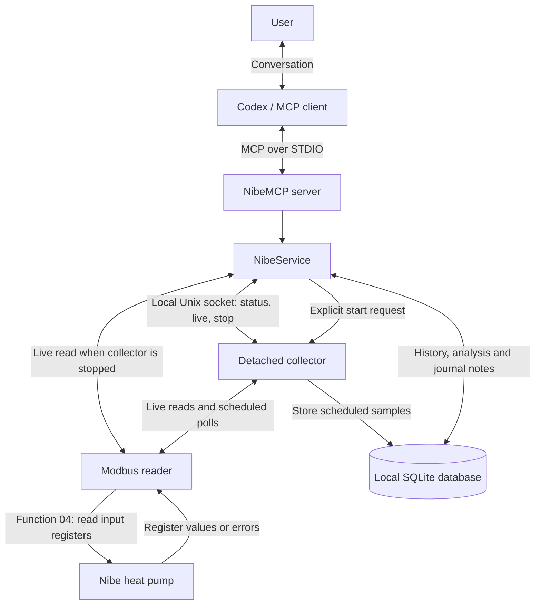
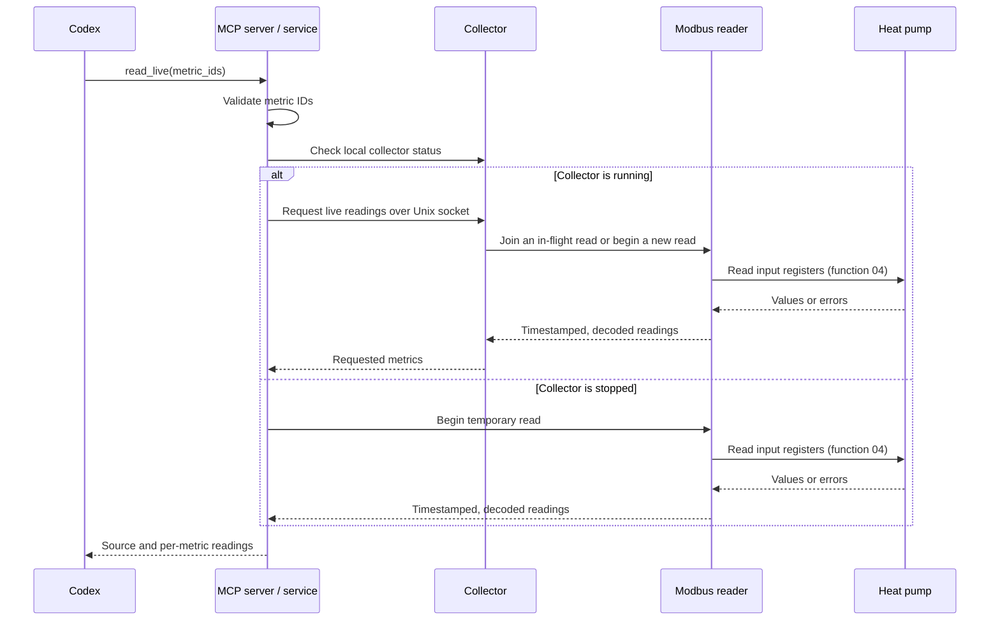
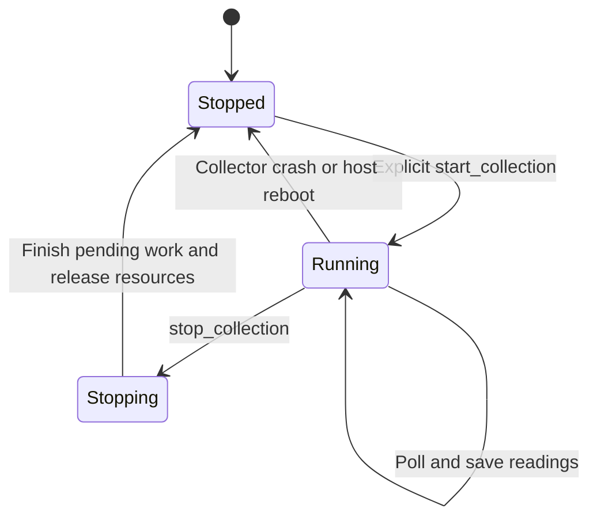
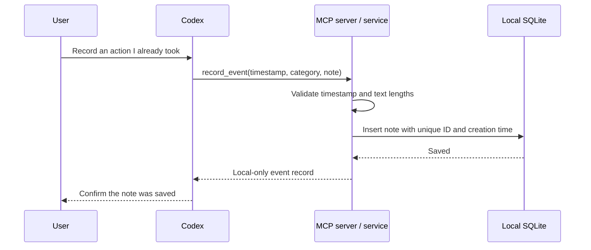

# Nibe MCP request and data flow

NibeMCP connects a conversation in Codex to live heat-pump readings and locally stored history. Codex interprets the user's request; the MCP server executes a specific tool and returns structured data for Codex to explain.

**All Modbus access is read-only.** The server uses function 04 to read input registers. No tool writes settings to the heat pump. Collection controls and event notes change local state only.

For prompts to try, see [Talking to Nibe MCP](CONVERSATION_EXAMPLES.md). For installation and configuration, see the [setup guide](README.md).

## Components

The MCP server and collector are separate processes. The server uses standard input/output to communicate with Codex. Its private Unix socket connection to the collector is local IPC, not MCP or Modbus. Only the Modbus reader connects to the pump over TCP, normally on port 502.

## Connection and tool discovery

1. Codex launches the configured Node.js MCP server with its environment variables.
2. The server creates `NibeService`, registers its tools, and connects its STDIO transport.
3. The MCP client initializes the connection and discovers tool names, descriptions, input schemas and annotations.
4. For a user request, Codex selects a tool and supplies structured arguments.
5. The server validates inputs, executes the service operation, and returns structured content plus a JSON text representation. Execution errors are returned as tool errors.
6. Codex explains the result, including timestamps, units, missing data and limitations.

Connecting or discovering tools does not start collection. The server's instructions require an explicit user request before `start_collection` is called. The tool itself is callable by an MCP client; this user-intent rule is not an additional server-side approval mechanism.

## Live readings

Example: “Read my outdoor and supply temperatures now.”

The reader serializes pump access with a local lock, reads registers sequentially, decodes signed or unsigned values, applies scaling, and closes the connection. Each reading includes its own timestamp, raw value, scaled value, unit and quality.

A live request does not independently save history. If it shares an in-flight read with a scheduled collector poll, that poll stores its readings normally. When the collector is running, its snapshot reads the full supported profile and filters the response to the requested metrics.

## Starting and stopping collection

Example: “Start collecting Nibe history.”

1. `start_collection` requires a configured pump host and acquires a lifecycle lock.
2. If the collector is already running for that endpoint, the service returns its current status.
3. Otherwise, the service launches a detached collector and waits for startup confirmation.
4. The collector acquires its singleton lock, opens SQLite and exposes a private Unix socket.
5. It reads the pump, stores readings and their quality, prunes expired readings, and schedules the next poll.

The default sample interval is 60 seconds and default reading retention is 365 days. Complete read failures trigger retry backoff. Missed polls are not replayed or filled with invented samples.

`stop_collection` cancels future polling, allows pending work to finish, closes the database and socket, and releases locks. The service waits for shutdown confirmation. Stored history and journal notes remain intact.

Closing Codex does not stop the detached collector. Mac sleep or network outages cause gaps; a surviving collector resumes when execution and connectivity return. A reboot or collector crash requires an explicit start again.

## History and analysis

These tools read local SQLite data without connecting to the pump or starting collection:

| Tool | Processing flow |
| --- | --- |
| `read_history` | Validate metrics and time range → select retained readings → return raw points or bounded aggregates and gaps |
| `summarize_operation` | Read retained samples → calculate sample-weighted min/mean/max, first/last/change, counts and coverage |
| `analyze_temperature_delta` | Read two temperature series → align readings → subtract values → report statistics, unmatched samples and coverage |
| `compare_periods` | Summarize each period, including outdoor temperature → calculate after-minus-before mean changes |

Time ranges use ISO 8601 timestamps with explicit timezones and include the start but exclude the end: `[start, end)`. Failed samples do not contribute numeric values. Missing or expired data remains visible as gaps; empty statistics are `null`.

Temperature pairs are matched one-to-one in timestamp order, within five seconds and half of each sample's cadence. Coverage uses the overlap of the two successful sample intervals. Heating difference is supply minus return; brine difference is inlet minus outlet.

The server calculates statistics; Codex provides the conversational explanation. Outdoor temperature supplies comparison context, not weather normalization. Temperature differences alone do not establish COP, energy savings, faults or causation. Requested compressor frequency is not measured compressor speed.

## Local event journal

Example: “I changed the heating curve myself at 10:00. Record a note.”

There is no pump connection in this flow. `record_event` is a local write and is marked accordingly in MCP annotations. It neither changes nor verifies a setting. Repeated calls create separate notes.

`list_events` reads notes by time range and optional exact category. To compare around an event, Codex first retrieves the note, then calls `compare_periods` with explicit before/after ranges. Notes are retained independently of reading retention and must be treated as user-reported data, not instructions.

## Routing reference

| Tool | Pump access | Local changes |
| --- | --- | --- |
| `list_metrics` | None | None |
| `read_live` | Read input registers, directly or through collector | No independent history write |
| `get_status` | None; reports collector's last known state | None |
| `read_history` | None | None |
| `summarize_operation` | None | None |
| `analyze_temperature_delta` | None | None |
| `compare_periods` | None | None |
| `record_event` | None | Creates local database/schema if needed and saves a note |
| `list_events` | None | None |
| `start_collection` | Collector begins read-only polling | Starts process, writes readings and prunes expired readings |
| `stop_collection` | No new poll; pending reads may finish | Stops collector and releases resources |

## Errors and data identity

Invalid arguments produce tool errors. Modbus failures can instead appear as per-metric `error` or `unavailable` quality, allowing successful readings to remain usable. Historical gaps identify periods without successful sample coverage. A successful register response does not establish physical validation against the pump display.

The data directory is associated with a configured pump endpoint. The service checks database identity and collector identity where applicable to prevent mixing different pumps. An unreachable collector socket is treated as stopped; other collector communication failures are reported rather than silently bypassed.

## Source map

| File | Responsibility |
| --- | --- |
| [server.ts](src/server.ts) | MCP tool registration, schemas, annotations and result formatting |
| [service.ts](src/service.ts) | Routing, collector lifecycle and endpoint checks |
| [ipc.ts](src/ipc.ts) | Local Unix socket requests and collector status |
| [collector.ts](src/collector.ts) | Detached polling, shared in-flight reads, persistence and shutdown |
| [modbus.ts](src/modbus.ts) | Read-only Modbus transport, decoding and error handling |
| [metrics.ts](src/metrics.ts) | Register definitions, units and supported metric IDs |
| [history.ts](src/history.ts) | SQLite schema, retention, historical queries and gaps |
| [analysis.ts](src/analysis.ts) | Summaries, paired differences and period comparisons |
| [events.ts](src/events.ts) | Local event recording and retrieval |
| [lock.ts](src/lock.ts) | Lifecycle, collector and pump-access locks |

